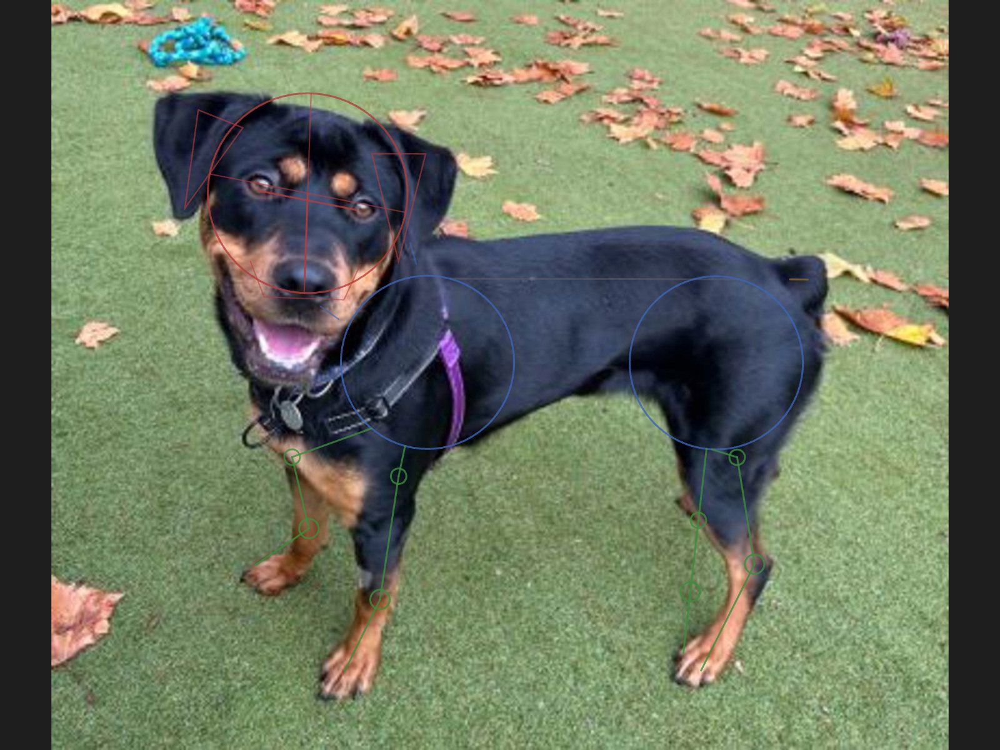
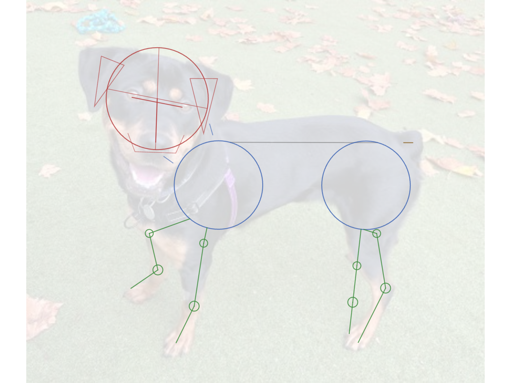
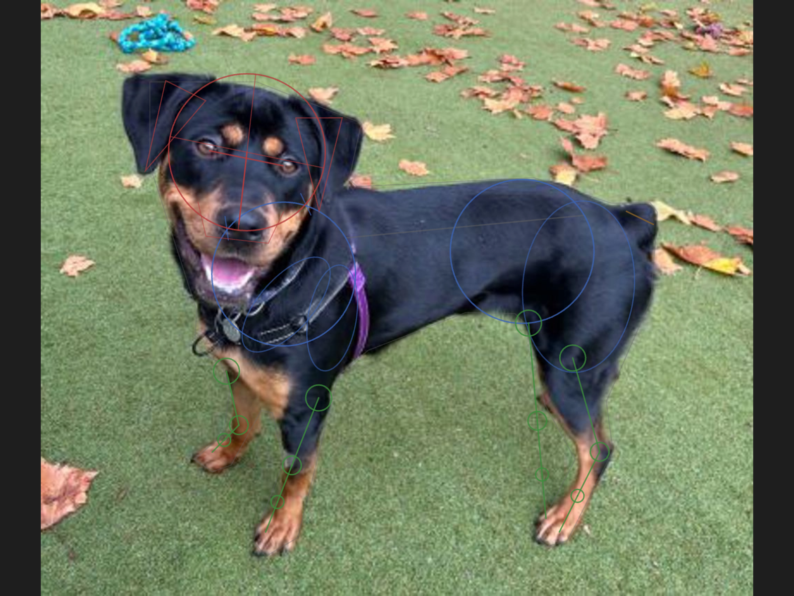
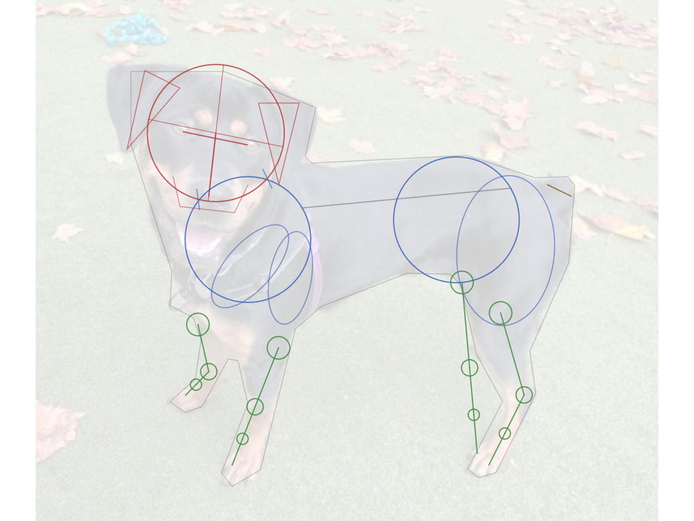

# Output examples — Phase 1 vs Phase 2

All four images below are **real renders from the actual pipeline** (Flask
server → DLC SuperAnimal keypoints + YOLO → p5.js construction renderer) on the
**same input photo**: a side-on rescued black-and-tan Rottweiler-cross standing
on autumn grass (the project fixture). Captured at 2× canvas resolution
(1600×1200).

The point of the pair is to show what the **Phase 2** renderer adds over the
original **Phase 1** construction, given identical detected keypoints.

## Phase 1 — base construction

See [PLAN.md](../PLAN.md).

- 🔴 **Head** — sphere + cross-axis + muzzle wedge + ear triangles
- 🔵 **Two body circles** — ribcage (front) and pelvis (rear), sized from the
  withers↔hip distance
- 🟢 **3-segment legs** — body-slot → knee knot → paw
- ⚪ **Spine** line
- 🟡 **Draggable anchor handles** — low-confidence anchors drawn larger so the
  user knows which to correct

| Over the photo | Clean construction sheet |
|---|---|
|  |  |

## Phase 2 — anatomical volumes + silhouette

See [PLAN-phase2.md](../PLAN-phase2.md). Everything in Phase 1, **plus**:

- **Silhouette polygon** (YOLOv8n-seg) — faint backdrop, and it **clamps the
  body-circle radii** to the dog's real width so the circles sit on the body
  instead of overshooting
- 🔵 **Haunch + shoulder mass ovals** — rotated ellipses around the rear thighs
  and front shoulders, giving the body circles a sense of muscle mass
- 🟢 **4-segment legs** — thigh → knee/elbow → hock/wrist → paw, with
  anatomically-graded **joint balls** (largest at hip/shoulder, smallest near
  the paw)

| Over the photo | Clean construction sheet |
|---|---|
|  |  |

## The two views

- **`*-overlay.png`** — construction drawn over the photo on a dark background
  (what you see live in the app).
- **`*-construction.png`** — the "print sheet": white background with the photo
  faded right back, so the construction lines read on their own as a drawing
  guide.

## What's next (Phase 3)

Phase 2 volumes are 2D ellipses fitted to keypoints. Phase 3 (planned, on the
`phase3-spike` branch — see [PLAN-phase3.md](../PLAN-phase3.md)) would fit a 3D
parametric dog model (BITE/SMAL) so the ribcage, pelvis and legs become
depth-correct, breed-aware volumes, plus a hand-drawn stroke style.
